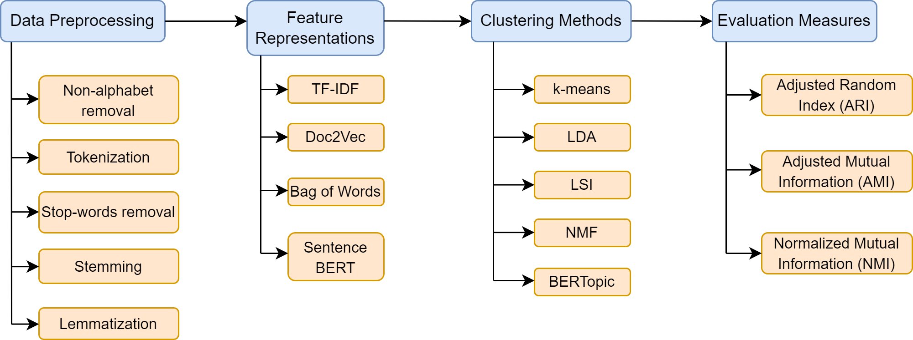
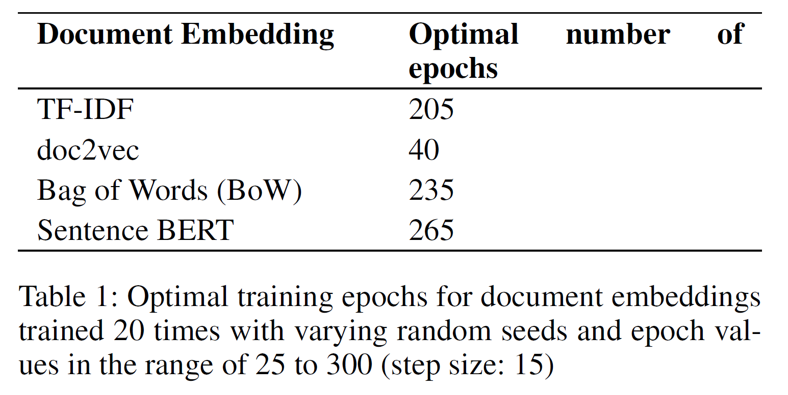
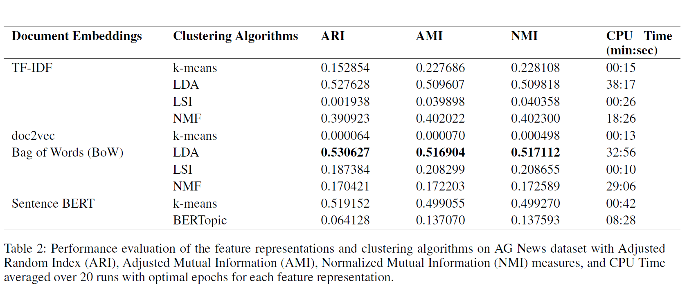

# Analyzing Clustering Algorithms for Topic Modelling

## Dataset 
[AG News](http://groups.di.unipi.it/~gulli/AG_corpus_of_news_articles.html)

## Analysis Pipeline

## Optimal number of epochs for document embeddings

## Performance evaluation

