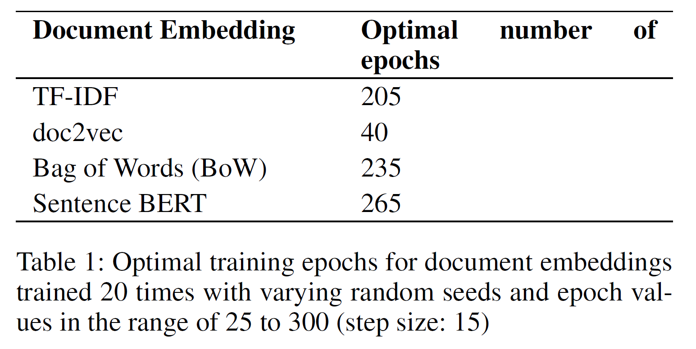
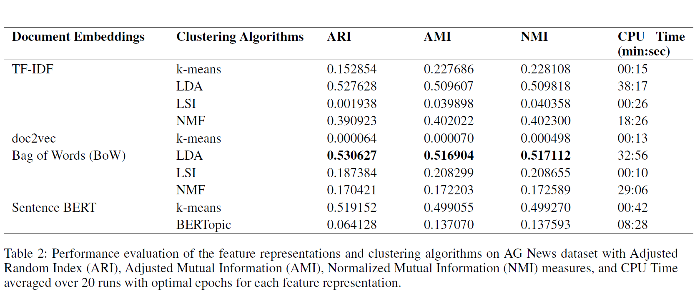

# Analyzing Clustering Algorithms for Topic Modelling
I evaluate several techniques for document embeddings and clustering on the AG News dataset. Four different feature representations including Term Frequency-Inverse Document Frequency (TF-IDF), doc2vec, Bag of Words (BoW) and Sentence BERT are combined with four clustering techniques, i.e., k-means, Latent Dirichlet Allocation (LDA), Latent Semantic Indexing (LSI), and BERTopic to benchmark the dataset. Three different evaluation measures have been used to measure the performance of the topic clustering algorithms on news description, and the most appropriate extrinsic measure has been suggested for evaluation.

The results show that corpus based embedding: Bag of Words (BoW) outperforms the others, however, comparable results have been portrayed by transformer based embeddings: Sentence BERT, taking a fraction of time as compared to the top performer, Bag of Words (BoW).

## Dataset 
**AG News:** The AG’s corpus of news articles was obtained from the web. It contains 496,835 categorized news articles from more than 2000 news sources. The four largest classes (i.e., ‘Business’, ‘Sci/Tech’, ‘Sports’, ‘World’) were chosen from this corpus to construct the dataset, using only title and description fields. The number of training samples for each class is 30,000 and testing 1900, totalling 120,000 training and 7600 testing samples. The average length of the news description is 193 characters.
[Dataset link](http://groups.di.unipi.it/~gulli/AG_corpus_of_news_articles.html)

## Dependencies
- python 3.7.12
- re 2.2.1
- nltk 3.2.5
- gensim 4.1.2

## Analysis Pipeline

## Optimal number of epochs for document embeddings
Number of epochs is the key hyper-parameter for training a neural network. Large number of epochs can lead to over-fitting the data, however, a lower number of epochs can lead
to under-fitting and bad performance. First, the performance change of the mean TF-IDF, doc2vec, Bag of Words (BoW) and Sentence BERT models were explored with the number of epochs. I used k-means clustering as it gave the best results for the embedding representations. For each epoch value between 25 and 300, with increments of 15, I trained the models 20 times using different random seeds and evaluated against the ground truth labels of the dataset. Table 1 summarizes the optimal number of epochs for each of the embeddings.

## Performance evaluation
The mean evaluation measures for the four feature representations with the clustering methods are discussed. Table 2 provides the mean for each of the three evaluation measures and the CPU time taken to train and test the models. I have set the optimal number of epochs as per the findings in the previous section, i.e. 205 epochs for TF-IDF, 40 epochs for doc2vec, 235 epochs for Bag of Words (BoW), and 265 epochs for Sentence BERT.

Bag of Words (BoW) and LDA outperformed the traditional TF-IDF-based approaches. Also, Sentence BERT performs reasonably well with the k-means clustering algorithm and can be used instead of the top-performing Bag of Words (BoW) and LDA combination, because it takes the least amount of time among the top-3.

## Future Work
- Inculcating more dimensionality reduction techniques,
- Using distributed doc2vec embedding for more flexibility with clustering algorithms, and supervised document embeddings, like, Universal Sentence Encoder (USE),
- Using word and document embeddings as pre-trained initial layers.

## References
- [Curiskis, Stephan A et al. (2020). “An evaluation of document clustering and topic modelling in two online social networks: Twitter and Reddit”. In: Information Processing & Management 57.2, p. 102034.](https://www.sciencedirect.com/science/article/pii/S0306457318307805) 
